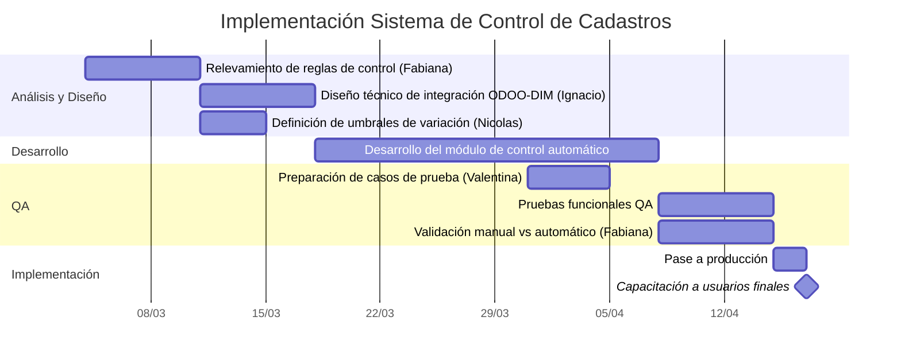

# Clase Cuatro - 28 de Agosto de 2026

# Repaso 

* Agente Preconstruido de Excel
    * Graficos / Tablas
        * Graficos dinamicos
        * Tablas dinamicas
    * Analisis / ML
        * Prediccion de Valores Futuros
        * Clasificacion
        * Deteccion de anomalias
* Limitantes de copilto Chat para trabajar con excel desde la interfaz Chatbot

# Prompt Engineering

  * Plan de Hoy : Casos de Uso de Admi y Logistinca

# Prompt

* Parte de un Prompt
  * Tarea + Contexto + Ejemplos + Rol/Persona + Formato + Tono
 
* Los prompts para tares especificas suelen tener cierta longitud, ser especificos y llevar cierto tiempo de trabajo

### Prompt Gallery 

* Un lugar donde vos guardas los prompts que usas habitualmente

  

* Ese iconito tipo senialador de libro

> Despues averiguar donde esta la galeria de prompts

* En un chat nuevo abajo hay ... donde se puede accer a las solicitudes guardadas


---

## Contexto

* Conversacion

---

## Multimodalidad

* Capacidad que tiene los modelos de lenguaje de interpretar no solo texto / Sino tambien imagenes

* Tengo esta factura
* 


* LE pongo este prompt
```
Me podes generar esta factura como texto
```

* Me da este texto

```
SHENZHEN TOP TEXTILES CO., LTD.

No. 88 Bao'an Industrial Road, Shenzhen, Guangdong, China
Tel: +86 755 8823 4471
Email: sales@stt-textiles.cn

COMMERCIAL INVOICE

Invoice No.: INV-2026-0341
Date: 15/02/2026

Buyer: Costa Oriental S.A.
Buyer Address: Ruta 8, Km 17.5, Montevideo, Uruguay
Order Ref.: PO-COR-0219

Terms: FOB Shenzhen
Vessel/ETA: MSC ARIANNA / 12/03/2026
Currency: USD


-----------------------------------------------------------------------------------------
SKU        Descripción                                   Cant.  Peso Unit.  Peso Total  Precio FOB  Total FOB
                                                        (cajas)    (kg)        (kg)      Unit.(USD)    (USD)
-----------------------------------------------------------------------------------------
TXT-1042   Tela sintética impermeable, rollo 50m          120      18.50      2,220.00      42.00     5,040.00

TXT-1055   Hilo de poliéster industrial, caja x 200u       80       9.20        736.00      15.50     1,240.00

TXT-1071   Cinta reflectiva de seguridad, rollo 100m       60       6.80        408.00      22.30     1,338.00

TXT-1089   Tela geotextil no tejida, rollo 30m             45      24.10      1,084.50      38.90     1,750.50

TXT-1103   Correas de sujeción industrial, paquete x 50u   30      11.40        342.00      19.75       592.50
-----------------------------------------------------------------------------------------

TOTAL PESO (kg): 4,790.50
TOTAL FOB (USD): 9,961.00


Packing:
5 pallets, embalaje en cajas de cartón corrugado sobre pallet estándar.
Marcas y números: COR / SHENZHEN / 2026 / 1-5.

País de origen: China.
Puerto de embarque: Shenzhen (Yantian).
Puerto de destino: Montevideo, Uruguay.


____________________________________
Firma autorizada — Shenzhen Top Textiles Co., Ltd.
```

---

### Generacion de Reportes a partir de imagenes

* Me pasaron varias imagenes

```
En base a las imagenes adjintas generarme una tabla donde muestre unificado para todos las imagenes  Codigo, Descripcion, Cantidad,  Unidad de Medida, Valor unitario. Mostrame primero la tabla aqui.
```

* Generamos un Excel con estas imagenes

> [!NOTE]
> Ir agregano de a batche de 10/20 facturas, no hacerlo todo de una porque es invalidable y aumenta riego de cometer erroes

---

## Formato

### Generación de flujos / diagramas de Gantt a partir de resumen de reuniones

* Lenguaje Mermaid
   * Es ideal para generar a partir de texto diagramas

* Primero hay que conseguir en TEXTO la transcipcion de la reunion / Charla
      Ejemplo : https://github.com/estebancalabria/copilot/blob/main/data/transcripcion-reunion.md

* Luego usamos este prompt

```
Queiro que apartir del contenido de esta reunion lo analices y me generes utilizando el lenguaje mermaid un diagrama de gant donde se visualize las tareas que se definieron realizar
```

* Me genero este diagrama



### Generación de flujos / diagramas de Gantt a partir de procedimientos “punto a punto” del cliente

> [!NOTE]
> En este caso en vez un gant voy a utilizar un flowchart en mermaid

```
Generación de flujos / diagramas de Gantt a partir de procedimientos “punto a punto” del cliente
```

* Esto me genero este flowchart

```
flowchart TD

    A["Inicio<br/>Aviso de arribo"] --> B["Verificación de documentación<br/>B/L, Factura, Packing List"]
    B --> C["Control de concordancia<br/>VIA / DUA"]

    C --> D{¿VIA y DUA<br/>coinciden?}

    D -- No --> E[Retener trámite]
    E --> F{¿Corregido<br/>antes de 24 hs?}
    F -- Sí --> G[Coordinación de descarga]
    F -- No --> X[Escalar a Gerencia de Administración]

    D -- Sí --> G

    G --> H[Descarga física y cubicación]

    H --> I{¿Existen diferencias<br/>de cadastro?}

    I -- No --> J[Control operativa masiva]
    I -- Sí --> K["Análisis conjunto<br/>Operaciones + Administración"]

    K --> L{¿Variación<br/>supera 10%?}

    L -- Sí --> M[Notificar al cliente]
    L -- No --> J

    M --> J

    J --> N{¿Operativa<br/>masiva?}

    N -- Sí --> O["Control de consistencia<br/>de volumen agregado"]
    N -- No --> P[Ingreso definitivo al WMS]

    O --> P

    P --> Q["Validación final del<br/>Pedido de Venta en ODOO"]

    Q --> R[Habilitación para facturación]

    R --> S{¿Destino final<br/>o almacenamiento?}

    S --> T[Despacho a destino final]
    S --> U[Almacenamiento en depósito]

    T --> V[Fin]
    U --> V

    X --> W[Fin por excepción]
```

### Markdown

* Es el lenguaje nativo que usa la IA para formatear las salidas
* URL
   * https://es.wikipedia.org/wiki/Markdown
 
* El mermaid lo voy a utilizar para definir una plantilla exacta de como quiero que la IA me fenere la respuesta

* Vamos a generar una plantilla en Markdown indicando como quiero que genere la salida

```
# [Titulo]

# Fecha

> [Fecha de la Reunion]

# Participantes

* Participante 1
* Participante 2
...
* Participante 3

# Puntos detacados (Mostrar los 3 puntos mas importantes)

* [Punto 1]
* [Punto 2]
* [Punto 3]

# Resumen

[2 Parrafos de resumen de la reunion]

# Cita destacada

> [CITA DESTACADA QUE ALGUIEN DIJO Y AUTOR]
```

---

## Alucinaciones

* Ejemplo de ChatGPT inventando jurisprudencia
  * https://www.infobae.com/colombia/2026/06/09/consejo-de-estado-fijo-reglas-para-usar-la-inteligencia-artificial-en-la-justicia-tras-caso-de-abogado-que-habria-inventado-sentencias-con-chatgpt/

---

# Glosario 

* IA No es deterministica
   * El mismo prompt dos veces puede generar una respuesta distinta

---

# Embellecer un documento

* Herrmienta
   * 

# Tarea

* Tomar excels con los que trabajan habitualmente, **hacer una copia**, y apliar el agente de copilot para excel a ver que provecho le pueden sacar
