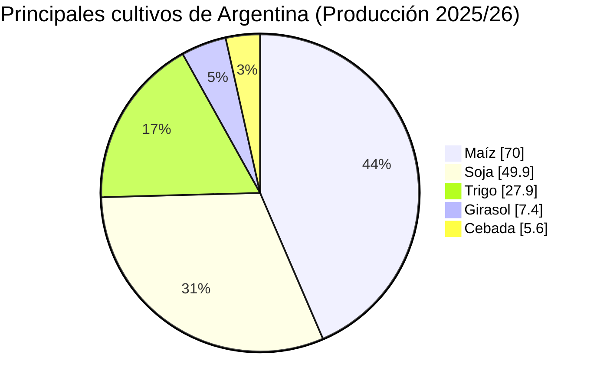

# Clase Cinco - 25 de agosto

# Repaso

* Prompt engineering
    * Biblioteca de prompt
        * Buscar 3 prompts de uso habitual
    * Contexto
      * Tecnica de Interaccion / Prompt Chainning
    * Rol
      * Tecnica de Persona
          * Actua como si fueras....
          * Repositorio con varios ejemplos de la tecnica
    * Formato
      * Tecnica de Personalizacion de Salida
        * Formatos Tecnicos
            * JSON / XML
        * Formatos de Presentacion
            * PDF
            * HTML
                * Lo exporto a pdf y queda de 10
            * Words, Excel. Powwerpoint
                * Version con Licencia
* Herrmientas
  * Gamma

---
 
# Prompt engineering

## Personalzacion de salida

### Formatos para diagramas

* Ejemplos de Diagramas
    * Gant
    * Bloques
    * Torta
    * Barras
 
* URL
    * https://mermaid.live/
 
#### Diagrama de Pie

* Prompt
```
Quiero que investigues online que se cultiva en argentina y que me hagas un diagrama  de PIE en mermaid donde se muestre los5 cultivos mas usados.
```

* Y se ve asi


