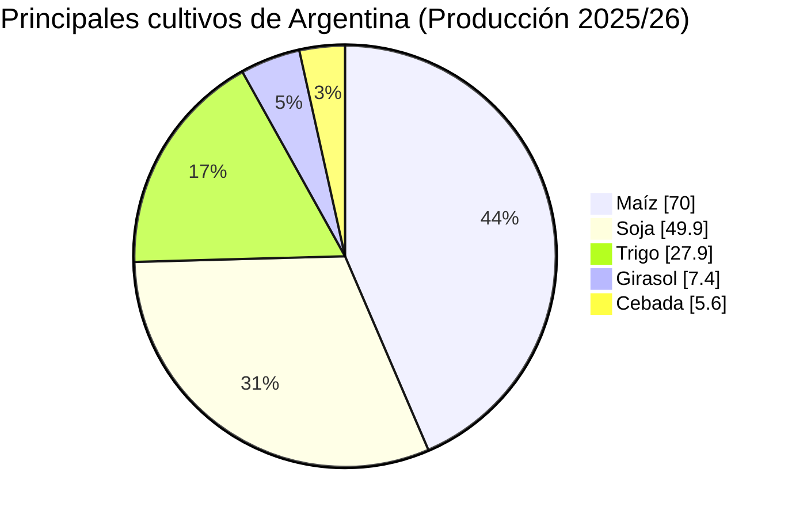
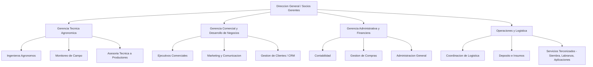
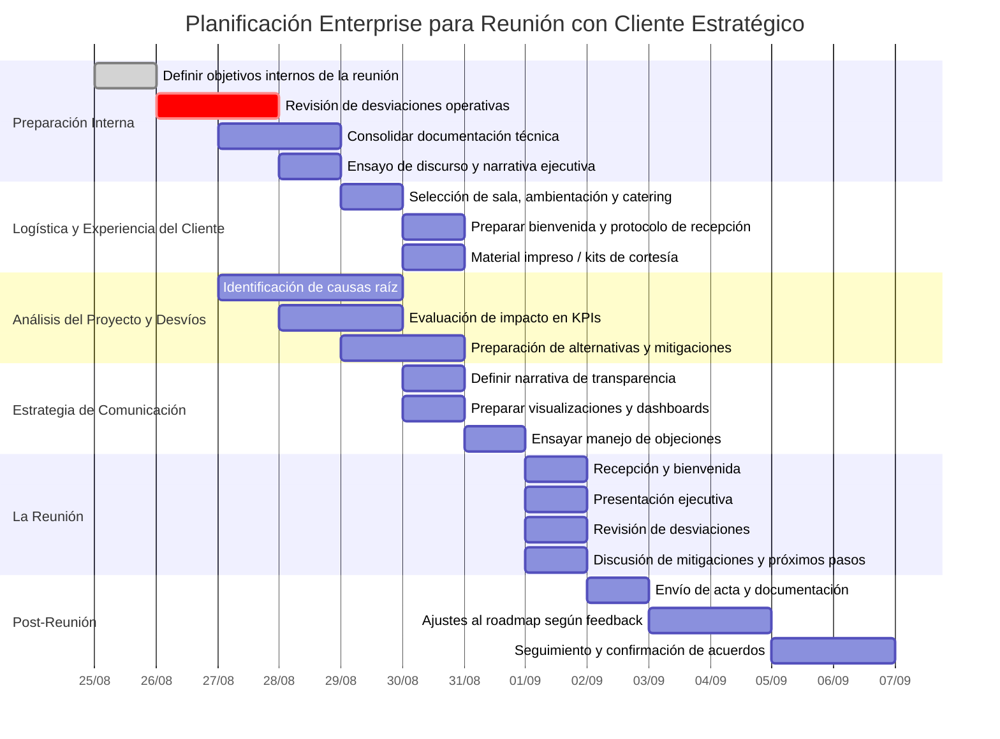

# Clase Cinco - 25 de agosto

# Repaso

* Prompt engineering
    * Biblioteca de prompt
        * Buscar 3 prompts de uso habitual
    * Contexto
      * Tecnica de Interaccion / Prompt Chainning
    * Rol
      * Tecnica de Persona
          * Actua como si fueras....
          * Repositorio con varios ejemplos de la tecnica
    * Formato
      * Tecnica de Personalizacion de Salida
        * Formatos Tecnicos
            * JSON / XML
        * Formatos de Presentacion
            * PDF
            * HTML
                * Lo exporto a pdf y queda de 10
            * Words, Excel. Powwerpoint
                * Version con Licencia
* Herrmientas
  * Gamma

---
 
# Prompt engineering

## Personalzacion de salida

### Informacion tabular

* Excel
* CSV
   * Comma sepparated Values
   * Esto se lleva muy con la IA
   * Si quiero adjuntar un Excel a la IA es una buena practica salvarlo como CSV
      * Le quitas las informacion del formato y te quedas con los datos crudos

```
Quiero un csv donde se ve el volumen de transporte de personas en tiempo y destino. Tenga los meses del 2026, 3 posibles destinos (cordoba, buenos aires, santa fe) y cuandas personas se transportaron a esos lugares. Generame datos de prueba.
```

* Genero

```
Mes,Destino,Personas
Enero,Cordoba,12500
Enero,Buenos Aires,30400
Enero,Santa Fe,9800
Febrero,Cordoba,13100
Febrero,Buenos Aires,29750
Febrero,Santa Fe,10220
Marzo,Cordoba,14050
Marzo,Buenos Aires,31500
Marzo,Santa Fe,11010
Abril,Cordoba,15020
Abril,Buenos Aires,32200
Abril,Santa Fe,11500
Mayo,Cordoba,15800
Mayo,Buenos Aires,33050
Mayo,Santa Fe,12040
Junio,Cordoba,16200
Junio,Buenos Aires,34500
Junio,Santa Fe,12500
Julio,Cordoba,17050
Julio,Buenos Aires,36000
Julio,Santa Fe,13020
Agosto,Cordoba,17500
Agosto,Buenos Aires,37200
Agosto,Santa Fe,13450
Septiembre,Cordoba,16800
Septiembre,Buenos Aires,35500
Septiembre,Santa Fe,12900
Octubre,Cordoba,18000
Octubre,Buenos Aires,38000
Octubre,Santa Fe,13800
Noviembre,Cordoba,19000
Noviembre,Buenos Aires,39500
Noviembre,Santa Fe,14200
Diciembre,Cordoba,21000
Diciembre,Buenos Aires,42000
Diciembre,Santa Fe,15000
```

### Formatos para diagramas : Mermaid

* Ejemplos de Diagramas
    * Gant
    * Bloques
    * Torta
    * Barras
 
* URL
    * https://mermaid.live/
* Caracteristicas
   * Lenguaje para representar en texto un grafico o diagrama
   * Lo maneja la IA en forma nativa
   * Funciona con cualquier llm como chatgpt, claude,etc ademas de copilot
   * Por lo general los LLM muestran una previsualizacion


> [!NOTE]
> Si genero un diagrama mermaid a partir de un excel, vale la pena revisar para asegurarme que la IA no alucino

#### Diagrama de Pie

* Prompt
```
Quiero que investigues online que se cultiva en argentina y que me hagas un diagrama  de PIE en mermaid donde se muestre los5 cultivos mas usados.
```

* Y se ve asi



#### Diagrama de bloques (flowchart)

* Prompt Utilizado

```
Investiga la informacion que encuentres de la empresa SMW agro y generame en mermaid un flowchat que muestre su organigrama.
```

> [!WARN]
> La primera generacion la hizo con errores, la tuve que corregir iterando

 * Genero esto:
   


#### Diagrama de Gantt

* Prompt

```
Tengo una reunion importante con un cliente la semana que viene. Quiero recibirlos. Agasajarlos y ademas discutir su proyecto y los devios. Necesito que me armes un diagrama de gant en mermaid donde realices una planificacion enterprise minuciosa para planificar la reunion
```

* Genero este diagrama
  


#### Formatos de Salida : Codigo

* Generar un algoritmo que muestre un grafico sin saber ni idea de programacion
* Lo LLM muchas veces tienen incorporado un interprete de codigo en Python
* Muchas veces la IA para resolver algo no me da la respuesta directamente sino el algoritmo que genera la respuesta
* Hay que conocer que existe en Python una libreria que se llama Matplotlib
   * https://matplotlib.org/
   * https://matplotlib.org/stable/gallery/index

> [!NOTE]
> Uso esta libreria cuando mermaid no me resuelve el diagrama que necesito

Tenemos el CSV del volumen transportado, vamos a generar un grafico ahora con matplotlib

```
Dada la informacion del volumne de personas transportadas utiliza el interprete de codigo y generame en Python con Matplotlib un grafico de stacked bart chart donde se vea una barra por mes del 2026 y en la misma barra diferenciado por color cuantas personas se transportaron a las distintas provincias
```

* Genera este grafico


* Genero este codigo

```
import pandas as pd
import matplotlib.pyplot as plt

# Datos
datos = {
    "Mes": [
        "Enero", "Febrero", "Marzo", "Abril", "Mayo", "Junio",
        "Julio", "Agosto", "Septiembre", "Octubre", "Noviembre", "Diciembre"
    ],
    "Cordoba": [
        12500, 13100, 14050, 15020, 15800, 16200,
        17050, 17500, 16800, 18000, 19000, 21000
    ],
    "Buenos Aires": [
        30400, 29750, 31500, 32200, 33050, 34500,
        36000, 37200, 35500, 38000, 39500, 42000
    ],
    "Santa Fe": [
        9800, 10220, 11010, 11500, 12040, 12500,
        13020, 13450, 12900, 13800, 14200, 15000
    ]
}

df = pd.DataFrame(datos)

# Crear gráfico
plt.figure(figsize=(14, 7))

plt.bar(df["Mes"], df["Cordoba"], label="Córdoba")
plt.bar(
    df["Mes"],
    df["Buenos Aires"],
    bottom=df["Cordoba"],
    label="Buenos Aires"
)
plt.bar(
    df["Mes"],
    df["Santa Fe"],
    bottom=df["Cordoba"] + df["Buenos Aires"],
    label="Santa Fe"
)

# Títulos y etiquetas
plt.title("Personas transportadas por destino - 2026", fontsize=16)
plt.xlabel("Mes")
plt.ylabel("Cantidad de personas")

plt.legend(title="Destino")
plt.xticks(rotation=45)

plt.tight_layout()
plt.show()
```

> [!NOTE]
> Supongan que la IA esta rebelde y genera el codigo, pero no genera el grafico. Lo puedo ejecutar en google colab
> https://colab.google/

#### Formatos de Salida : HTML

* Generacion de un dashboard interactivo con Mermaid

```
Me podes generar un html que muestre graficos en mermaid tipo dashboard que sea interactivo donde pueda cambiar la visualizacion segun lo que selecciono
```

* Me genero este dashboard interactivo
   * https://github.com/estebancalabria/copilot/blob/main/cursos/2026-Jun-SWE-Agro/clase-05/dashboard_transporte_mermaid_2026.html
 
  
