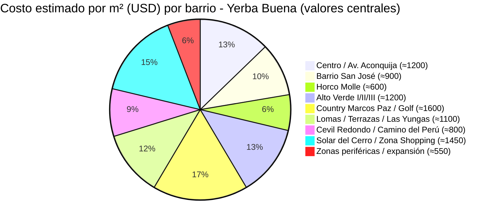

# Clase Tres - 18 de Mayo 2026

# Repaso

* Copilot
  * Editar en Pagina
* Prompt Engineering
    * Prompt Efectfico = Tarea + Contexto + Rol + Ejemplo + Formato + Tono
      * Contenxto
          * Memoria
          * Prompt
          * Conversaciones Pasadas
          * Instrucciones personalizadas
          * Microsoft Graph
            * Integracion con Ondrive /Teams/ Mails
    * Tecnicas de Prompting
        * Rol / Persona
            * El rol del experto
            * Panel de Expertos
        * Interaccion (Metodo Socratico)
            * Decir que te haga las preguntas de a una
        * Personalizacion de Salida
            * JSON, XML : Formatos mas tecnicos
            * HTML : Generar PDFS
            * CSV : Para interacturar con Ecel

---

# Eleccion del modelo

* **Noveddad** : Microsoft incorporo el modelo Opus
* Modelos disponibles
  * Opus : Pregunstas tecnicas
  * GPT (quick Response) : Redaccion e integracion con Graph (El utilizado el 90% de los casos)
  * GTP (Thinking) : Cuando son preguntas que requieren de razonamiento logico
    * Ej : Que terreno me conviene comprara siendo un analista comparativo

---

# Prompt Engineering

## Personalizacion de Salida : Markdown

> https://es.wikipedia.org/wiki/Markdown

* Es el lenguaje por defecto que utilizan todos los llm para darle formato a la salida

* Problemas
  * Genero un informe con Copilot y cuando lo paso a word que da en un formato "feo" y el tiempo que gane generando el informe lo invierto cambiandole el formato en Word.
  * Como vuelvo las respuestas de la IA mas deterministicas (que me reponda mas parecido, tener mas control sobre el formato de la salida)

* No basamos en el prompt de la clase pasada
```
Haceme una lista de barrios de Yerba Buena, Tucuman. De cada barrio quiero saber poblacion aproximada, costo metro cuadrado aproximado, trasnporte, edificios, actividad comercial. (Busca en internet)
```


* Solucion
 * Generar una plantilla en markdown de como quiero exatamente la respuesta
   
```
# [Nombre del Barrio]

## Caracteristicas

* Costo Metros Cuadrados : [COMPLETAR] $
* Pobacion Estimada : [COMPLETAR]
* Perfil : [Completar]
* Tipo de Edificacion : [Completar]
* Tipo de Edificacion : [Actividad comercial]

## Transporte

* [ENUMERAR EN BULLETS MEDIOS DE TRANSPORTE PARA ACCEDER]

## Puntos de Interes

* [ENUMERAR EN BULLETS]

## Inversion

> [Uno o dos parrados de texto relaccionados con oportunidades de inversion]

---
```

* Con esto se lo pido a copilot que me lo genere respetando una plantilla

* Si tomo la salida y la pego en Word me respeta titulos, bullets, negritas, etc


> [!NOTE]
> El markdown es el lenguaje estandar elegido en genral para escribir system prompts y prompst coplejos que quiero que se repeten en forma estricta

## Personalizacion de Salida : Mermaid

> https://mermaid.live/

* Generar Diagramas a partir de texto

```
Quiero que me generes un diagrama de pie en mermaid donde se pueda visualizar el costo por metro cuadrado de los distintos barrios.
```

* Genero esto


---

# Copolit en Excel

* Abrir copilot en excel y darle este prompt

```
Generarme 100 filas con datos de prueba de proyectos inmobiliarios en el barrio de Yerba Buena, Tucuman.Queiro ubicacion, Barrio, metros cuadrados, porcentaje de inalizacion, costo actual, costo estimado. (Hay Varios proyectos)
```

## Tablas Diamicos (Pivot Table)

```
Generame una hoja nueva donde se vea una tabla dinamica (pivot table) para represetnar e interacturar con los datos
```
* Y lo genera

## Graficos Dinamicos (Pivot Charts)

```
Generame una hoja nueva donde se vea un grafico dinamico (pivot chart) para rerpesentar e interacturar con la informacion.
```
* Y lo genera

# Dashboards Interactivos

* Clave para la toma de decisiones
```
Creame un dashboard inmobiliario interactivo  usando tablas dinamicas, graficos diniamicos y segmentadores (Slices). Hacerlo en un libro nuevo
```

---

# Proxima Clase
 
* Agente que ya trae copilot
   * Agente Analista


